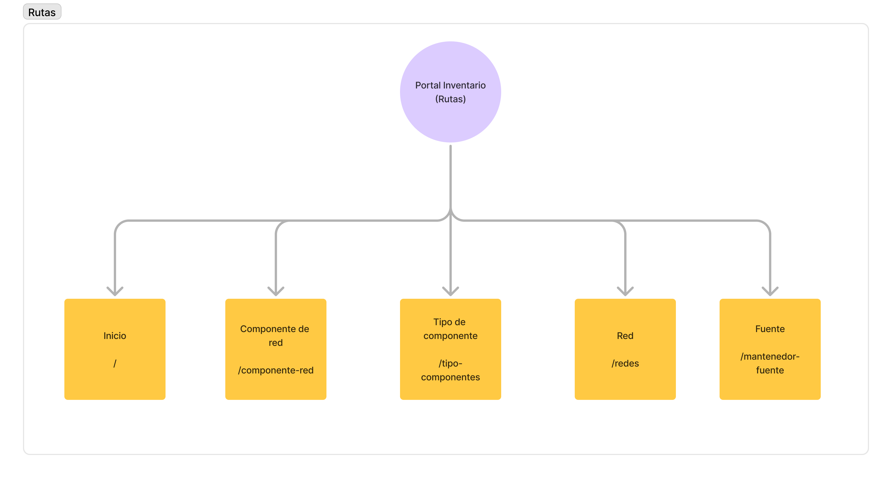

# Table

## Dependencia

- TBody: componente encargado de mostrar las filas y columnas de las datas que recibimos.
- TEmpty: mostrar mensaje informativo indicandole al usuario que no hay datos que mostrar.
- THead: componente encargado de mostrar cada titulo por columna.
- TLoading: componente solo para mostrar que estamos cargando la data
